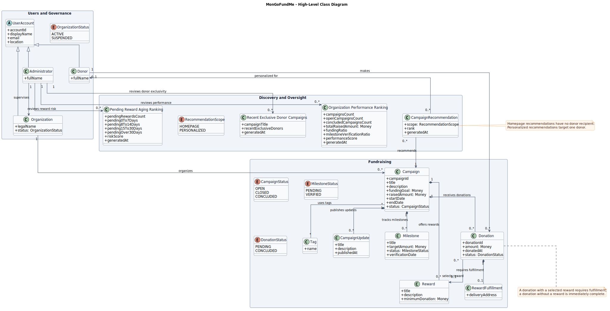
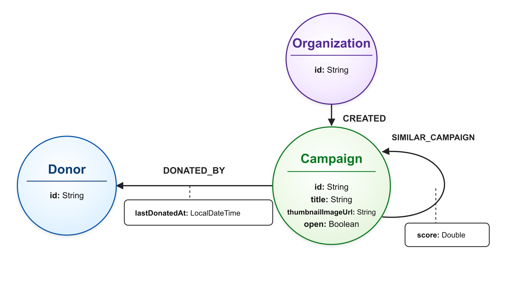

# MonGoFundMe

MonGoFundMe is a Spring Boot application for managing crowdfunding campaigns, donations, organizations, donors, dashboards, recommendations, and administrative statistics.

## Main Stack

- Java 17 with Spring Boot
- MongoDB as the primary document database
- Neo4j as the secondary graph database for campaign relationships and recommendations
- JWT-based stateless authentication
- Swagger UI for REST API exploration

## Documentation and Visuals

- Project documentation: [MonGoFundMe_DOCUMENTATION.pdf](MonGoFundMe_DOCUMENTATION.pdf)
- Static HTML pages: [`html/`](html/)

### UML Diagram



### Neo4j Graph Structure



### Static HTML Preview

Sample screenshot from [`html/Home.html`](html/Home.html):


## MongoDB

The application expects a MongoDB replica set named `rs0` with three reachable members:

```text
localhost:27017
localhost:27018
localhost:27019
```

The local profile uses the `mongofundme` database and this URI:

```text
mongodb://localhost:27017,localhost:27018,localhost:27019/?replicaSet=rs0&readPreference=primary&readConcernLevel=majority&w=majority&wtimeoutMS=5000
```

MongoDB stores the core business documents, including users, campaigns, donations, dashboards, homepage recommendations, rankings, and outbox events.

## Neo4j

The application expects Neo4j at:

```text
neo4j://127.0.0.1:7687
```

The configured database is:

```text
neo4j
```

Neo4j stores the graph projection used for campaign similarity and donor campaign recommendations.

## Run

Start MongoDB and Neo4j using the addresses above, then run:

```sh
mvn spring-boot:run
```

The application runs with the `local` profile by default.

## Load Seed Data

The generated JSON documents are stored under `data/mongo/`. To load them into
the local databases, start MongoDB and Neo4j using the addresses above, then run:

```sh
python3 scripts/seed_mongodb.py
python3 scripts/seed_neo4j_graph.py
```

`seed_mongodb.py` drops and reloads the MongoDB collections used by the
application. `seed_neo4j_graph.py` clears and rebuilds the Neo4j graph from the
same campaign, organization, donor, and donation JSON documents.
